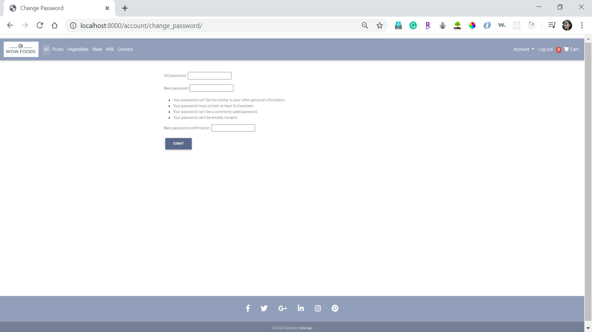

## A dynamic e-commerce web application made by using Django
*	Applied User authentication in Django to work with User objects: Authenticate the login user to access to the personal profile, change password, reset password, manage shopping cart.
*	Created model to interface with the database (User, Item, OrderItem, Order).
*	Applied Mdbootstrap framework, allowing user to have a great UI experience.

### Demo:

